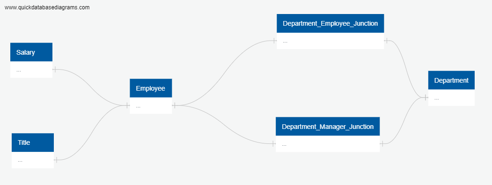
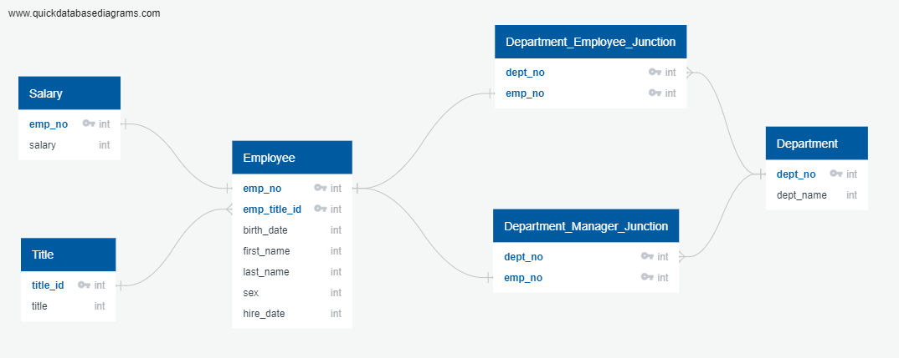
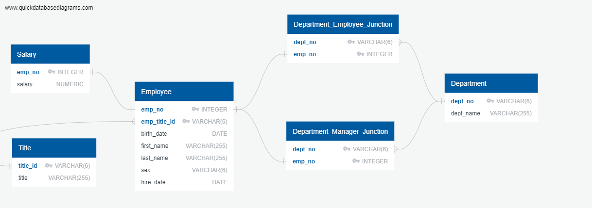
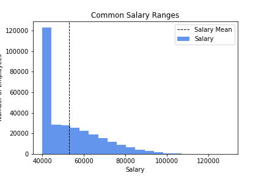

# SQL Homework - Employee Database: A Mystery in Two Parts (Solved)

## Background - Solved

It is a beautiful spring day, and it is two weeks since you have been hired as a new data engineer at Pewlett Hackard. Your first major task is a research project on employees of the corporation from the 1980s and 1990s. All that remain of the database of employees from that period are six CSV files.

In this assignment, you will design the tables to hold data in the CSVs, import the CSVs into a SQL database, and answer questions about the data. In other words, you will perform:

1. Data Engineering

3. Data Analysis

Note: You may hear the term "Data Modeling" in place of "Data Engineering," but they are the same terms. Data Engineering is the more modern wording instead of Data Modeling.

## Before You Begin - Solved

1. Please check the homework solution to SQL challenge in for this in GIT HUB repository project called `sql-challenge`.

2. Please find the link to this repository from GIT HUB:

    https://github.com/anand-sharan/sql-challenge

3. Clone the new repository to your computer to view the solution.

# Instructions to check the solution

### Data Modeling - Solved

1. Please check the following images to view the ERD digrams of the tables which were sketched after inspectes the CSVs and sketch out an ERD of the tables.

2. Please check the following images to view:

    Conceptual ERD:

    

    Logical ERD:

    

    Physical ERD:

    

3. I have used the tool [http://www.quickdatabasediagrams.com](http://www.quickdatabasediagrams.com) to create the diagrams.

4. The following files contain the diagraming code used to create the diagram:

    Conceptual ERD diagraming code:
      EmployeeSQL/ERD_image/conceptual_schema.txt

    Logical ERD diagraming code:
      EmployeeSQL/ERD_image/logical_schema.txt

    Logical ERD diagraming code:
      EmployeeSQL/ERD_image/physical_schema.txt

### Data Engineering - Solved

#### Using the information on the csv files and ERD digrams, please check the following schema file containing the table schema for each of the six CSV files. I have specified data types, primary keys, foreign keys, and other constraints.
      EmployeeSQL/Resources/sql_challenge_schema.sql

Tables
  1. department
  2. title
  3. employee
  4. salary
  5. department_manager_junction
  6. department_employee_junction

#### Primary keys and Composite primary keys
1. department table's primary key is department_pkey
2. title table's primary key is title_pkey
3. employee table's primary key is employee_pkey
4. department_manager_junction table's composite primary key is department_manager_junction_pkey
5. department_employee_junction table's composite primary key is department_employee_junction_pkey

#### Foreign primary keys:
1. title to employee forgein key is employee_title_id_fkey
2. department to department_manager_junction forgein key is department_manager_junction_dept_no_fkey
3. employee to department_manager_junction forgein key is department_manager_junction_emp_no_fkey
4. department to department_employee_junction forgein key is department_employee_junction_dept_no_fkey and 
5. employee to department_employee_junction forgein key is department_employee_junction_emp_no_fkey

#### Please find the correct order of table creation to handle foreign keys:
Tables
  1. department
  2. title
  3. employee
  4. salary
  5. department_manager_junction
  6. department_employee_junction

* Be sure to create tables in the correct order to handle foreign keys.

Tables
  1. department
  2. title
  3. employee
  4. salary
  5. department_manager_junction
  6. department_employee_junction

* Import each CSV file into the corresponding SQL table. **Note** be sure to import the data in the same order that the tables were created and account for the headers when importing to avoid errors. Please find location and order of the csv files
      1. EmployeeSQL/data/departments.csv
      2. EmployeeSQL/data/titles.csv
      3. EmployeeSQL/data/employees.csv
      4. EmployeeSQL/data/salaries.csv
      5. EmployeeSQL/data/dept_manager.csv
      6. EmployeeSQL/data/dept_emp.csv

#### Data Analysis - Solved

Please check the following SQL file containing the solved queries to answer the data analysis questions:
      EmployeeSQL/Resources/solved_queries.sql

Once you have a complete database, please execute the queries in the attached files do the following:

1. List the following details of each employee: employee number, last name, first name, sex, and salary.

2. List first name, last name, and hire date for employees who were hired in 1986.

3. List the manager of each department with the following information: department number, department name, the manager's employee number, last name, first name.

4. List the department of each employee with the following information: employee number, last name, first name, and department name.

5. List first name, last name, and sex for employees whose first name is "Hercules" and last names begin with "B."

6. List all employees in the Sales department, including their employee number, last name, first name, and department name.

7. List all employees in the Sales and Development departments, including their employee number, last name, first name, and department name.

8. In descending order, list the frequency count of employee last names, i.e., how many employees share each last name.

## Bonus (Optional) - Solved

1. Please check the Jupyter Notebook at location EmployeePy/employee.ipynb to view the solution to the Bonus

2. Create a histogram to visualize the most common salary ranges for employees.

      

3. Create a bar chart of average salary by title.

      

## Epilogue

Evidence in hand, you march into your boss's office and present the visualization. With a sly grin, your boss thanks you for your work. On your way out of the office, you hear the words, "Search your ID number." You look down at your badge to see that your employee ID number is 499942.

## Submission

* Create an image file of your ERD.

* Create a `.sql` file of your table schemata.

* Create a `.sql` file of your queries.

* (Optional) Create a Jupyter Notebook of the bonus analysis.

* Create and upload a repository with the above files to GitHub and post a link on BootCamp Spot.

* Ensure your repository has regular commits (i.e. 20+ commits) and a thorough README.md file

### Copyright

Trilogy Education Services © 2019. All Rights Reserved.
